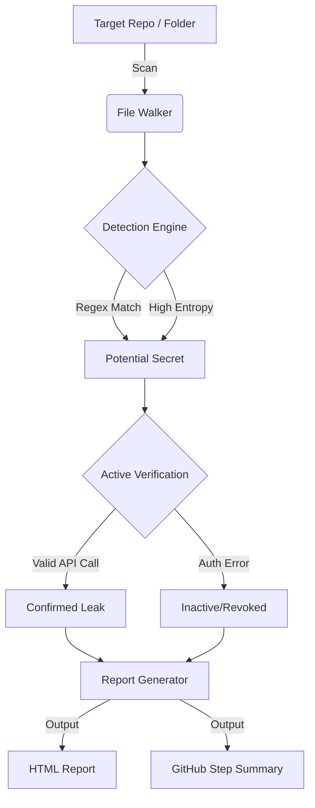

#  SecretShield

[](https://www.python.org/)
[](./LICENSE)
[](https://github.com/YonatanBiton/SecretShield)

**SecretShield** is an advanced security scanner designed to detect **hardcoded secrets, API keys, and credentials** within source code repositories and Dockerfiles.

Unlike traditional regex scanners that flag *any* suspicious string, SecretShield features an **Active Verification Engine**. It detects a key, determines the provider (e.g., AWS, Stripe), and safely pings the provider's API to validate if the key is **live** and **exploitable**. This drastically reduces false positives and prioritizes real threats.

---

## 🚀 Key Features

* **🔍 High-Fidelity Detection:** Uses a combination of regex patterns and **Shannon Entropy analysis** to find obfuscated secrets.
* **⚡ Active Verification:** Connects to provider APIs (AWS STS, Stripe Balance, GitHub User, etc.) to check if credentials are valid.
* **🐳 Docker Security:** Scans `Dockerfile` configurations for security best practices (e.g., root user usage, latest tags).
* **📊 Multi-Format Reporting:** Generates interactive HTML reports and integrates directly with **GitHub Actions Job Summaries**.
* **🔄 CI/CD Native:** Designed to break builds in pipelines when critical vulnerabilities are found.

---

##  Architecture



---

##  Supported Providers

| Provider | Detection Method | Verification Check |
| :--- | :--- | :--- |
| **AWS** | `AKIA...` + Secret Context | `sts:GetCallerIdentity` |
| **GitHub** | `ghp_...` | User Profile API |
| **Stripe** | `sk_live_...` | Balance Endpoint |
| **GitLab** | `glpat-...` | User/Project Scope |
| **Slack** | `xoxb...` / `xoxp...` | `auth.test` |
| **Google** | `AIza...` | Generic API Call (WebFonts) |
| **DigitalOcean** | `dop_v1_...` | Account Info |
| **Private Keys** | PEM Headers | *Detection Only* |

---

##  Installation

### Prerequisites
* Python 3.10+
* Git

```bash
git clone [https://github.com/YonatanBiton/SecretShield.git](https://github.com/YonatanBiton/SecretShield.git)
cd SecretShield
pip install -r requirements.txt
```

---

## 💻 Usage

### 1. Scan a Local Directory
```bash
python src/main.py /path/to/project --html
```

### 2. Scan a Remote Repository
SecretShield allows you to scan any public Git repository without cloning it manually.
```bash
python src/main.py [https://github.com/username/repo-name](https://github.com/username/repo-name)
```

---

## 🤖 GitHub Actions Integration

SecretShield is designed to run inside your CI/CD pipeline. It will:
1.  Scan every Pull Request.
2.  **Fail the build** if critical secrets are found.
3.  Post a summary table directly to the GitHub Actions workflow UI.

Create a file at `.github/workflows/security-scan.yml`:

```yaml
name: SecretShield Security Scan

on: [push, pull_request]

jobs:
  secret-scan:
    runs-on: ubuntu-latest
    steps:
      - name: Checkout Code
        uses: actions/checkout@v3

      - name: Setup Python
        uses: actions/setup-python@v4
        with:
          python-version: '3.10'

      - name: Install Dependencies
        run: |
          git clone [https://github.com/YonatanBiton/SecretShield.git](https://github.com/YonatanBiton/SecretShield.git) tools/SecretShield
          pip install -r tools/SecretShield/requirements.txt

      - name: Run SecretShield
        env:
          GITHUB_STEP_SUMMARY: $GITHUB_STEP_SUMMARY
        run: |
          # Scans the current repo (.)
          python tools/SecretShield/src/main.py . --html
```

---

## Screenshots

### 1. The Interactive HTML Report
A detailed dashboard showing severity breakdown and exact code locations.


### 2. CLI Output & Verification
Real-time feedback in the terminal showing "Active" status for leaked keys.

> ** 
**

### 3. CI/CD Integration (GitHub Summary)
How results appear inside the GitHub Actions "Summary" tab.

> **[Place a screenshot of the GitHub Actions Summary Table here]**
> *Tip: This is critical for recruiters to see you understand DevOps workflows.*

---

## Project Structure

```text
SecretShield/
├── src/
│   ├── main.py       # CLI Entry Point
│   ├── scanner.py    # File Traversal & Logic
│   ├── rules.py      # Regex Patterns & Entropy Math
│   ├── validator.py  # Active API Verification Engine
│   └── reporter.py   # HTML & Markdown Generators
├── requirements.txt
└── README.md
```

---

##  Disclaimer & License

**License:** MIT

**Disclaimer:** This tool is intended for **security testing purposes only**.
Active verification involves sending credentials to third-party APIs. While `SecretShield` only hits "safe" endpoints (like `get_caller_identity` or `balance`), you should only use this tool on repositories you own or have explicit permission to audit.
